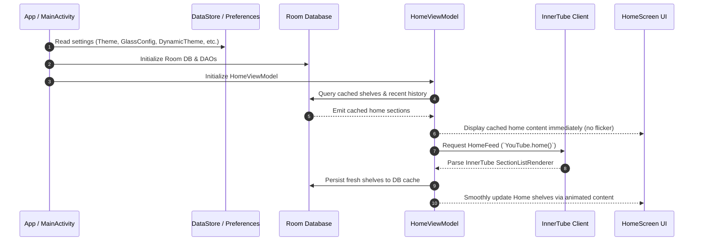
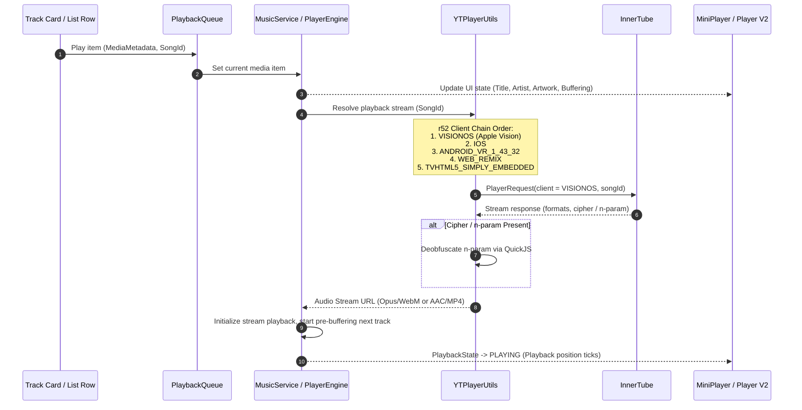
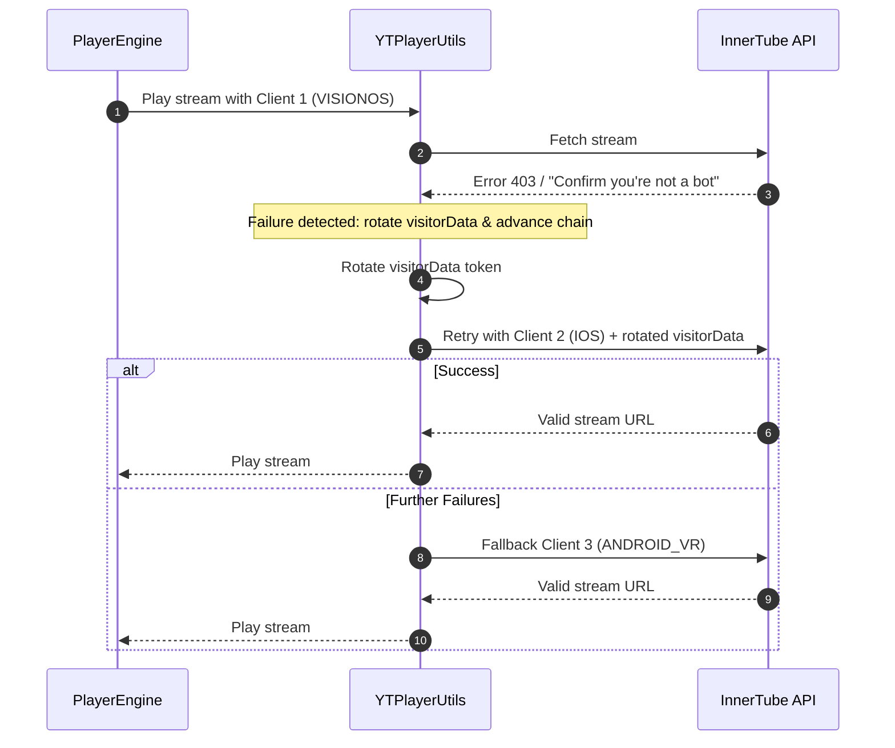
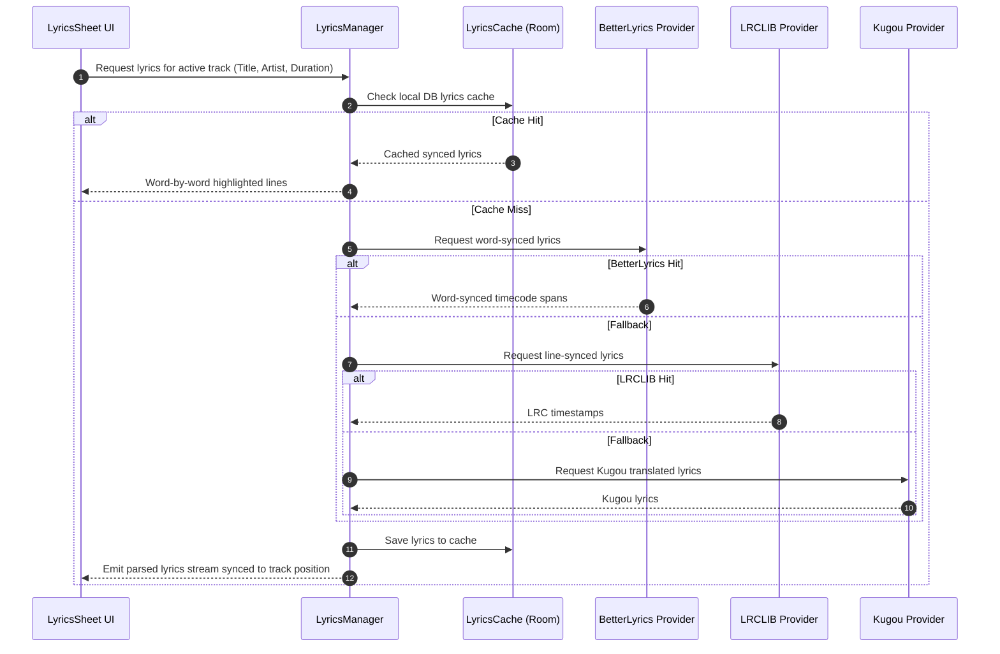

# System Flows & Architecture (Phase 1 Audit)

Detailed sequence diagrams for critical subsystems of Convx r52.

## 1. Cold Start → Home Loaded

## 2. Tap a Song → Client Chain → Stream URL → Player UI

## 3. Playback Failure → Retry → visitorData Rotation → Fallback

## 4. Synced Lyrics Flow

## 5. Preset Export / Import Schema

Presets in Convx r52 store:
- `layout`: JSON sticker coordinates and scale
- `playerIcons`: custom control glyph slot mappings
- `glassConfig`: blur, vibrancy, lensHeight, lensAmount, surfaceTint, highlightOpacity
- File format: UTF-8 JSON bundle with version tag, keeping complete backward and forward compatibility with Android.
